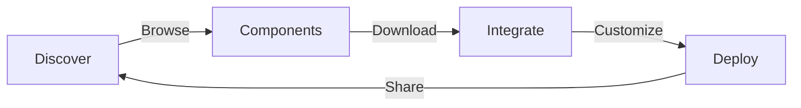
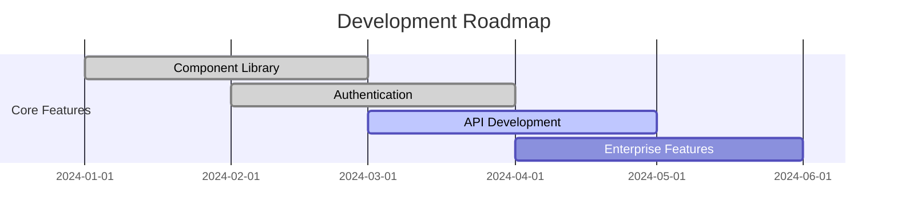
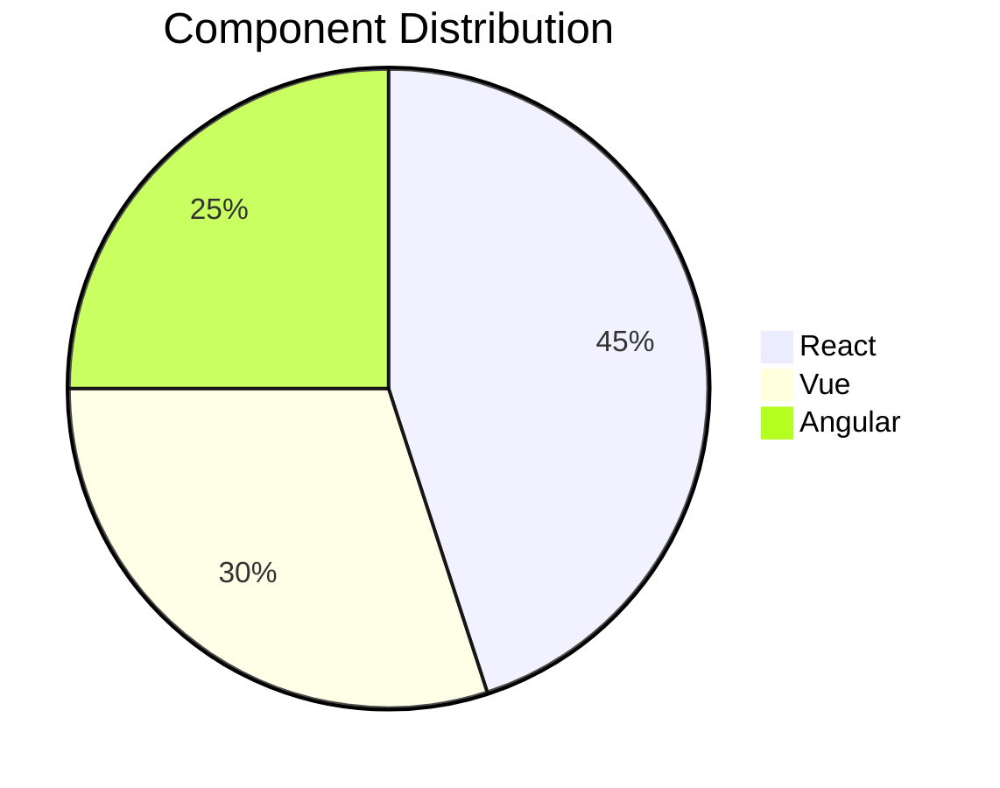
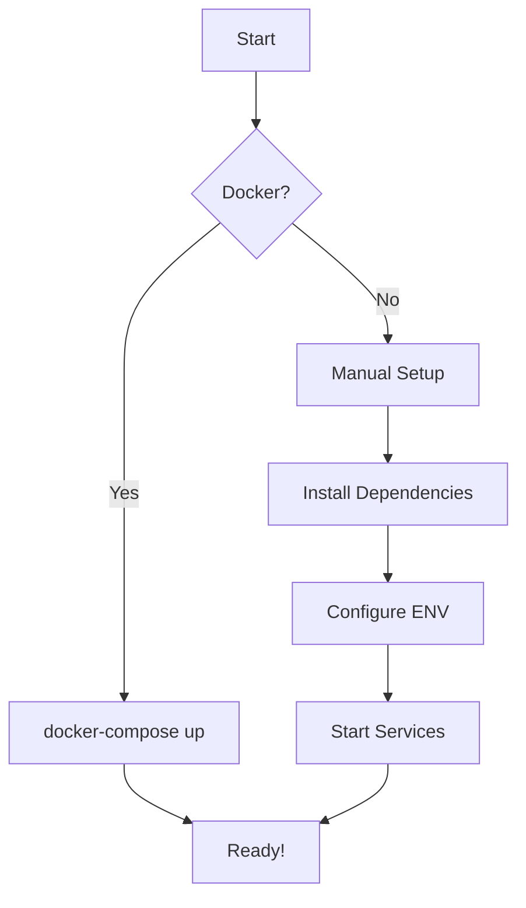

# 🚀 StoreHUB
### Where Code Sharing Meets Innovation

<div align="center">

[](https://github.com/rishyym0927/StoreHUB/stargazers)
[](https://github.com/rishyym0927/StoreHUB/network)
[](https://github.com/rishyym0927/StoreHUB/issues)
[](https://github.com/rishyym0927/StoreHUB/blob/main/LICENSE)
[](https://discord.gg/your-invite-link)

[View Demo](https://storehub.dev) • [Report Bug](https://github.com/rishyym0927/StoreHUB/issues) • [Request Feature](https://github.com/rishyym0927/StoreHUB/issues)


</div>

## 🌟 Why StoreHUB?

StoreHUB transforms component sharing into a seamless experience. Built by developers, for developers, it's where innovation meets practicality.

<div align="center">



</div>

## 🎯 Features That Set Us Apart

<div align="center">

| Feature | Description | Status |
|---------|------------|---------|
| 🔍 Smart Search | AI-powered component discovery | ✅ Live |
| 🤝 Collaboration | Real-time co-editing support | ✅ Live |
| 🌐 Multi-Framework | Support for React, Vue, Angular | ✅ Live |
| 🔒 Enterprise Security | SOC2 & GDPR compliant | 🚧 Coming Soon |
| 📊 Analytics | Usage insights & metrics | 🚧 Coming Soon |

</div>

## 📈 Project Growth



## 🛠️ Tech Stack

<div align="center">

### Frontend


### Backend


</div>

## 🚀 Quick Start

```bash
# Clone the repository
git clone https://github.com/rishyym0927/StoreHUB.git

# Navigate to project directory
cd StoreHUB

# Start using Docker Compose
docker-compose up --build
```

Visit `http://localhost:3000` to see the magic! 🎉

## 📊 Performance Metrics



## 🤝 Contributing

We believe in the power of community! Here's how you can contribute:

1. 🍴 Fork the repository
2. 🌱 Create your feature branch (`git checkout -b feature/AmazingFeature`)
3. 💫 Commit changes (`git commit -m 'Add AmazingFeature'`)
4. 🚀 Push to branch (`git push origin feature/AmazingFeature`)
5. 🎉 Open a Pull Request

## 💻 Environment Setup



## 📄 License

MIT License - see the [LICENSE.md](LICENSE.md) file for details.

## 🌟 Our Contributors

<div align="center">

[](https://github.com/rishyym0927/StoreHUB/graphs/contributors)

</div>

## 📞 Support

<div align="center">

[](mailto:support@storehub.dev)
[](https://discord.gg/your-invite-link)
[](https://twitter.com/storehub)

</div>

---

<div align="center">

Made with ❤️ by the StoreHUB Team

[⬆ Back to top](#-storehub)

</div>